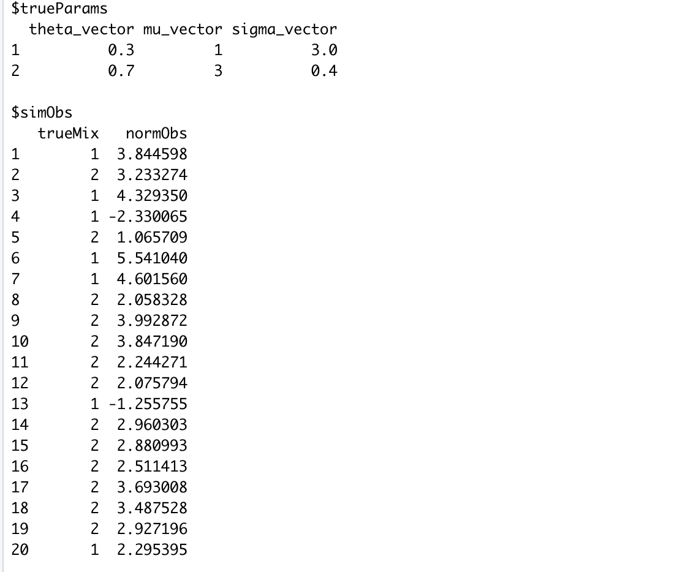
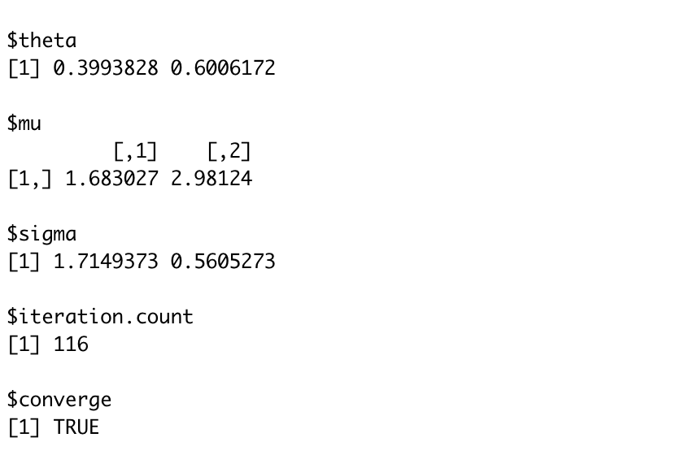
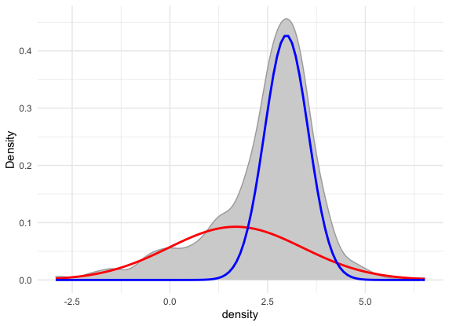
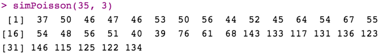
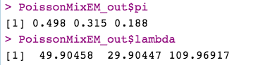
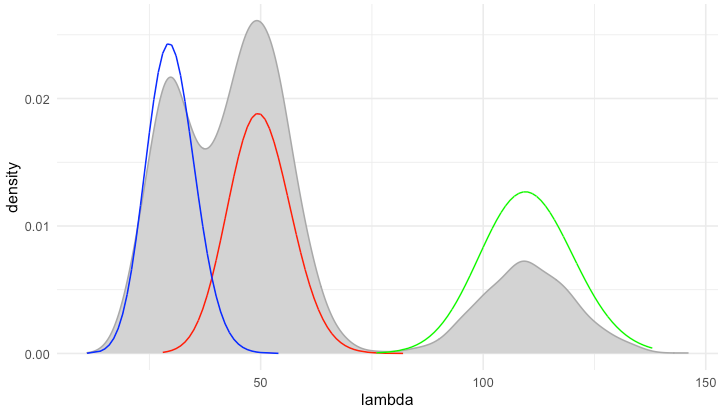
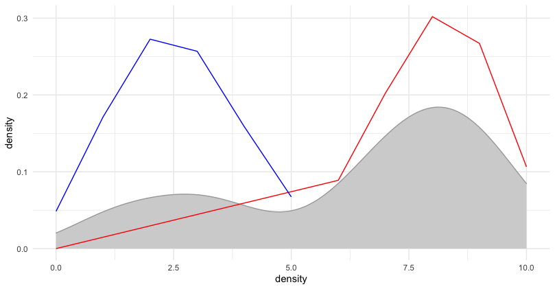

# mixtureEM

---

Package authors and contributors:
  - [Xiwen Jiang](mailto:xiwenj@uci.edu), University of California,Irvine
  - [Yekun Qin](mailto:yekunq1@uci.edu), University of California,Irvine
  - [Jiarong Feng](mailto:jiaronf1@uci.edu), University of California,Irvine

---

## Overview

mixtureEM is an R package for estimating parameters of mixture model using EM algorithm. The package supports mixtures of Guassian, Binomial, and Poisson.


The package has functions:

1. `mixnormal_loglikhood()`: Calculate the loglikelihood for observations generated from Gaussian mixture model. 

2. `mixnormal_EM()`: One of the main functions of the package. `mixnormal_EM` allows user to get MLE of the Gaussian mixture model by using EM algorithm. User should input dataset, initial value of weights, mean, and standard deviation. User could change max iteration count and criterion for defining convergence if they want. The function returns MLE of weights, mean and standard deviation of all components.

3. `simu_mixnormal()`: A function allows user to simulate data of Gaussian mixture model. User could generate certain size of dataset by specify number of mixture components, weight, mean and standard deviation.

4. `normalmix_plot()`: A function allows user to visualize Gaussian mixture model estimated from `mixnormal_EM()`


5. `binommixEstep()`: E step in EM algorithm for estimating binomial mixture model.

6. `binommixMstep()`: M step in EM algorithm for estimating binomial mixture model.

7. `binommixEM()`: One of the main functions of the package. `binommixEM` allows user to get MLE of the binomial mixture model by using EM algorithm. User should input dataset, initial value of weights and probability of success. The function returns MLE of weights and probability of success of all components, cluster assignment indicator and cluster assignment probability for all observations.

8. `rBinomMix()`: A function allows user to simulate data of binomial mixture model.

9. `binommixPlot()`: A function allows user to visualize binomial mixture model estimated from `mixnormal_EM()`

10. `poissonEstep()`: E step in EM algorithm for estimating Poisson mixture model.

11. `poissonMstepPi()`: M step in EM algorithm for estimating the proportion of components for Poisson mixture model.

12. `poissonMstepLambda()`: M step in EM algorithm for estimating the parameter lambda for each component of the Poisson mixture model.

13. `poissonMixEm()`: One of the main functions of the package. `poissonMixEm` allows user to get MLE of the Poisson mixture model by using EM algorithm. User should input dataset, initial proportion of each Poisson component and the lambda correspondingly. The function returns MLE of weights, the mean of each Poisson component, the origin dataset, z value, number of iteration in the EM algorithm, and the log likelihood at the end. 

14. `simPoisson()`: A function allows user to simulate data of Poisson mixture model.

15 `poissonMixPlot()`: A function allows user to visualize Poisson mixture model estimated from `poissonMixEm()`

## Installation

Since we haven't decided to release this package, you can only download this package by using SSH link. Sorry for that!

## Usage

### Mixture normal

#### Simulation

First, here is an exmple for simulation of mixture normal data using `simu_mixnormal()`. We simulate 20 observations from two normal mixture N(1,3) and N(3,0.4). The weight for the first normal is 0.3 and the weight for the second normal is 0.7. 

```{r }
simu_mixnormal(20,ncluster =2,theta_vector = c(0.3,0.7),mu_vector=c(1,3),sigma_vector=c(3,0.4))
```



There exists default value of number of mixtures(2), weight(0.3,0.7), mean(1,3), standard deviation(3,0.4) in the function. 

#### EM algorithm for normal mixture model

Next is an example of EM estimation of normal mixture model using `mixnormal_EM()`. We use `mixnormal_sample` in the package as dataset.User must provide initial value for estimation.The function returns MLE of weights, mean and standard deviation of all components.

``` {r }
normalEM_out <- mixnormal_EM(mixnormal_sample$simObs$normObs,
                               theta_vector = c(0.1, 0.9),
                               mu_vector = c(0.4, 1),
                               sigma_vector = c(2, 1))
```



#### Visualization of mixture models estimated by EM algorithm

Finally, we can use `normalmix_plot()` to visualize the mixture models estimated by EM algorithm.

```{r }
normalmix_plot(normalEM_out)
```



====
### Mixture Poisson

#### Simulation
First, here is an example for simulation of mixture Poisson data using `simPoisson()`. We simulate 35 observations from 3 Poisson mixture with random weight and random lambda.

```{r}
simPoisson(35, 3)
```



#### EM algorithm for Poisson mixture model

Next is an example of EM estimation of Poisson mixture model using `poissonMixEM()`. We use `test_pois$x` in the package as dataset, `pois_pi_init` as the initial value of weights for all component Poisson distribution, and `pois_lambda_init` as the initial value of the lambda for all component Poisson distribution. 

```{r}
PoissonMixEM_out <- poissonMixEM(data = test_pois$x, pi = pois_pi_init, lambda = pois_lambda_init)
```




#### Visualization of mixture models estimated by EM algorithm

Finally, we can use `poissonMixPlot()` to visualize the mixture models estimated by EM algorithm.

```{r}
poismixPlot(PoissonMixEM_out)
```



=======
### Mixture Binomial

The example below present how to simulate, fit, and visualize mixture binomial. 
Note, the current EM algorithm for mixture bionomial only support all samples have the same trail size.

We simulate 100 samples with Bin(10, 0.3) and Bin(10, 0.8), their corresponding weights are 0.3 and 0.7, using `rBinomMix()`. We fit this simulated dataset with EM algorithm for mixture binomial using `binommixEM`.

```{r}
sim_x <- rBinomMix(100, alpha=c(0.3, 0.7), theta=c(0.3, 0.8), size=10)
sim_n <- rep(10, 100)

bin_mix_fit <- binommixEM (sim_x, sim_n, k=2, 
                           pi_inits=c(0.2, 0.8), 
                           p_inits=c(0.4, 0.2))
```

Next, we can visualize the fitted results using `binommixPlot` as below.

```{r}
binommixPlot(bin_mix_fit)
```


